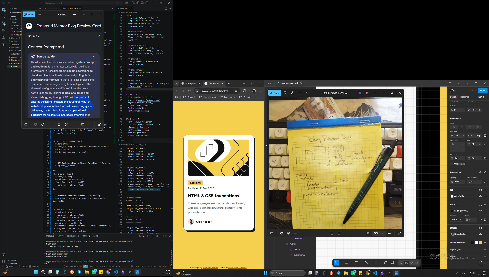

## Overview

This project is a **Blog Card Preview** component engineered with a **Mobile-First** and **A11Y-First** philosophy. The primary objective was to achieve high-fidelity replication of the Figma design while optimizing **CSS Architecture** for scalability and strict adherence to **WCAG** standards.

### The Challenge

The core challenge was to ensure that users navigating via keyboard or voice-assisted technologies experience clear **Interactive States**. I prioritized **A11Y** standards over literal design interpretation, treating the original Figma file as a conceptual guide to enforce robust accessibility.

### Links

- Solution URL: [GitHub](https://github.com/ezra1492/frontend-mentor-blog-preview)
- Live Site URL: [gh-pages](https://ezra1492.github.io/frontend-mentor-blog-preview/)

## My process

### Initial Architectural Blueprint



### Built with

Semantic HTML5, CSS3, Flexbox, clamp(), gh-pages:

- **Semantic HTML5 Architecture:** Use `<article>`, `<header>`, `<time>` with standard ISO 8601.
- **CSS3 Design Token Vault:** Centralize variables inside the global `:root` pseudo-class.
- **Flexbox Axis Orchestration:** Center the main component and its branches.
- **Viewport Resilience**: Use `clamp()` to avoid mobile card deformation.

### What I learned

- **Inline Baseline Descender Bug:** Total margin control by implementing `display: block` declaration inside inline elements like `<span>`, ``, `<time>`, `<a>`.

```
.blog-card__illustration {
  width: 100%;
  display: block; /* eliminates descenders space */
  height: auto;
  border-radius: var(--br-small);
}
```

- **BEM Orchestration & Atomic Targeting:** By using `.blog-card__element`.

```
.blog-card__date {
  display: block;
  margin-top: var(--sp-100);
  font-size: var(--fs-small);
  color: var(--clr-gray950);
}
```

- **Bidirectional Transitions:** By adding `transition` to the base class I achieved Visual Continuity.

```
.blog-card__link {
  display: block;
  color: var(--clr-gray950);
  text-decoration: none;
  font-size: var(--fs-big);
  margin: var(--sp-150) 0;
  transition: color 0.3s ease; /* mouse interaction, leaving the link area */
}

/* ===========
ACTIVE STATE ↓
============== */
.blog-card__link:hover,
.blog-card__link:focus-visible {
  color: var(--clr-yellow);
}

.blog-card__link:focus-visible {
  background-color: var(--clr-gray950);
  text-decoration: underline;
}

.attribution a:focus-visible {
  color: var(--clr-yellow);
  background-color: var(--clr-gray950);
  font-weight: var(--fw-bold);
}
/* ===========
ACTIVE STATE ↑
============== */
```

### Learning Reflection

1. **A11Y-First Focus Sates:** I shifted from a high-fidelity from a Figma-centric approach to an industry-standard-first framework.

2. **CSS Hygiene & Redundancy Elimination:** Even though the Figma design includes custom pointers, I learned to trust native browser rendering resources to avoid unnecessary assets.

### Continued Development

- **Flexbox Mastery:** Continue and deepen my understanding of the **Box Model**, debugging layouts with bright colors backgrounds.
- **Design Vault:** Ensure design resilience/scalability integrating `:root` pseudo-class, especially `clamp()` and its `min, ideal, max`.

### AI Collaboration

- Tool: NotebookLM (Gemini)
- Use: Architecture and Conventional Commits validation.

## Author

- [website](#)
- [Frontend Mentor](https://www.frontendmentor.io/profile/ezra1492)
- [Twitter](https://x.com/RayG1492)
